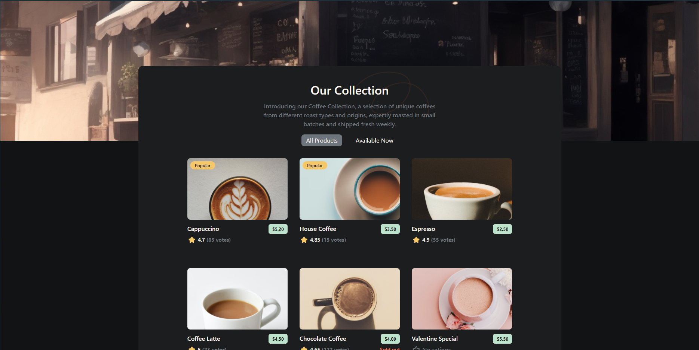
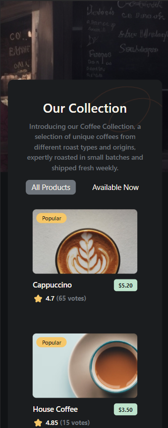

Il s'agit d'une solution pour le défi [Dev Challenges](https://devchallenges.io/challenge/45) sur Dev Challenges.

## Table des matières

- [Aperçu](#aperçu)
  - [Le défi](#le-défi)
  - [Capture d'écran](#capture-décran)
  - [Liens](#liens)
  - [Construit avec](#construit-avec)
- [Auteur](#auteur)

## Aperçu

### Le défi

- Afficher la liste des cafés avec les données fournies. Les données doivent venir d'une API.
- Les utilisateurs peuvent choisir de lister tous les produits ou seulement les produits disponibles.
- Être adapté à tout les écrans (mobile/tablet/desktop)

### Capture d'écran

### Liens

- [URL du site en direct](https://multi-step-form-b-alexandre.netlify.app)

### Construit avec

- Vite (Framework React)
- TailwindCSS
- Javascript

## Auteur

- Dev Challenge - [@CallMeAl3x](https://devchallenges.io/profile/4b9e326e-7fac-4811-b859-ca80373be3dd)